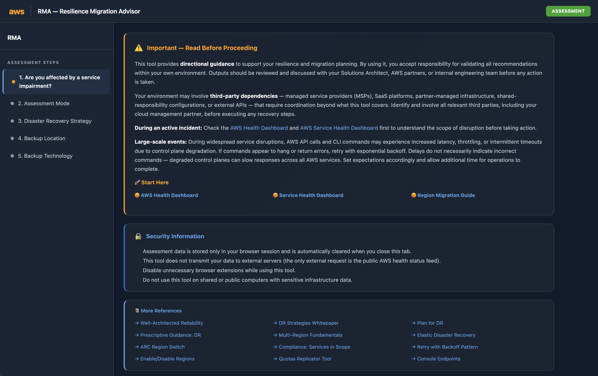
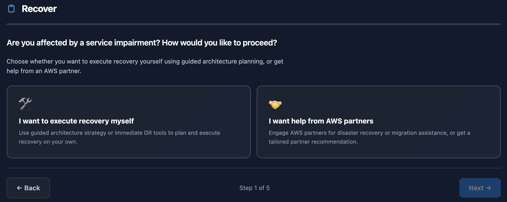
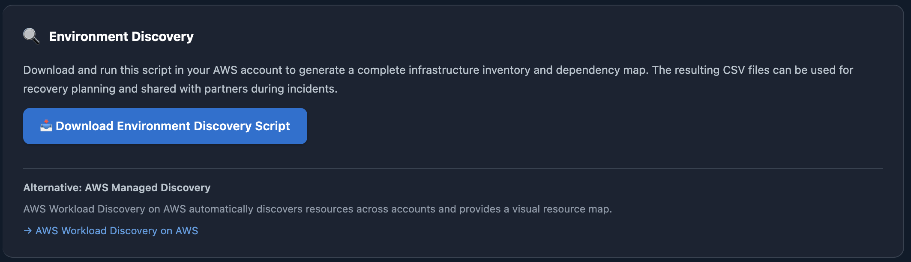
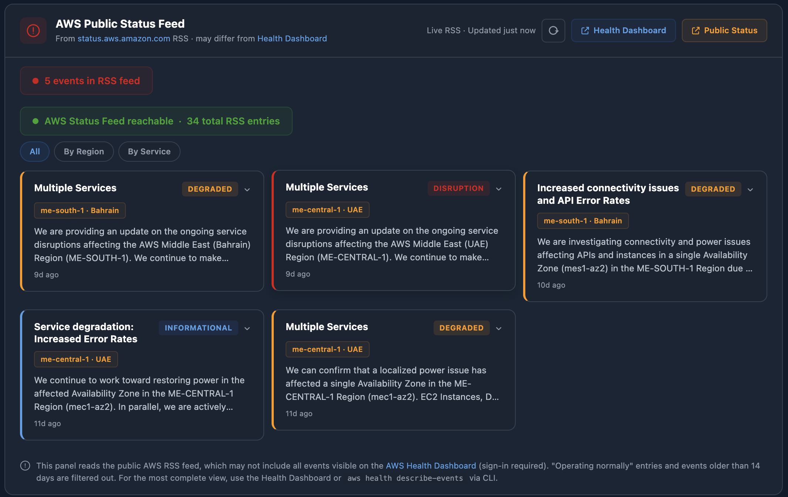

# 🛡️ Resilience Migration Advisor

> Resilience Migration Advisor (RMA) is a browser-based assessment tool that generates AWS resilience and migration recovery guidance — no backend, no data transmission, no account access from the browser.

> **Built on the [AWS Well-Architected Framework — Reliability Pillar](https://docs.aws.amazon.com/wellarchitected/latest/reliability-pillar/welcome.html)** and AWS prescriptive guidance for disaster recovery, multi-region architecture, and operational resilience.

---

## ⚠️ Important Disclaimer

This tool provides **directional guidance** to support your resilience and migration planning. By using it, you accept responsibility for validating all recommendations within your own environment. Outputs should be reviewed and discussed with your Solutions Architect, AWS partners, or internal engineering team before any action is taken.

Your environment may involve **third-party dependencies** — managed service providers (MSPs), SaaS platforms, partner-managed infrastructure, shared-responsibility configurations, or external APIs — that require coordination beyond what this tool covers. Identify and involve all relevant third parties, including your cloud management partner, before executing any recovery steps.

**During an active incident:** Check the [AWS Health Dashboard](https://health.aws.amazon.com/health/home) and [AWS Service Health Dashboard](https://status.aws.amazon.com/) first to understand the scope of disruption before taking action.

---

## 🏛️ Resilience as a Foundation

Resilience is not a feature you bolt on — it must be embedded in every layer of your architecture. From compute and storage to networking, data replication, DNS routing, and operational procedures, every component should be designed to withstand failure and recover gracefully.

RMA is built on this principle. The guidance it generates draws from:

- **[AWS Well-Architected Framework — Reliability Pillar](https://docs.aws.amazon.com/wellarchitected/latest/reliability-pillar/welcome.html)** — design for failure, test recovery, manage change
- **[AWS Disaster Recovery Whitepaper](https://docs.aws.amazon.com/whitepapers/latest/disaster-recovery-workloads-on-aws/disaster-recovery-options-in-the-cloud.html)** — Backup/Restore, Pilot Light, Warm Standby, Active/Active
- **[AWS Prescriptive Guidance — Multi-Region Fundamentals](https://docs.aws.amazon.com/prescriptive-guidance/latest/aws-multi-region-fundamentals/introduction.html)** — control plane vs data plane, dependency isolation, recovery re-protection
- **[AWS Region Migration Guides (re:Post)](https://repost.aws/articles/ARgWzmR04xQSiPsgpe18T2Hw)** — service-by-service migration procedures

Whether you are planning a proactive migration to improve your resilience posture or responding to an active service disruption, RMA helps you think through the right architecture, the right sequence of operations, and the right validation steps — across every layer of your stack.

---

## ✨ Features

| Feature | Description |
|---------|-------------|
| 🧙 Guided Assessment | Step-by-step wizard covering workload type, RTO/RPO, network topology, databases, and compliance |
| 📋 Recovery Runbooks | Auto-generated runbooks with copy-paste AWS CLI commands tailored to your selections |
| 🚨 Accelerated Recovery Mode | Emergency recovery path with partner tool integration (ControlMonkey, N2W, Firefly) |
| 🤝 Partner Matchmaking | Weighted scoring engine recommends the best-fit AWS partner for your situation |
| 🔍 Environment Discovery | Downloadable bash script that inventories AWS resources across all enabled regions, including S3 bucket sizes via CloudWatch metrics |
| 📊 Architecture Diagrams | SVG-based DR architecture visualizations (Active/Active, Warm Standby, Pilot Light, Backup/Restore) |
| 🔒 Security Hardened | CSP enforcement, XSS protection, session-scoped storage, CSV injection prevention |
| 🎯 Architecture Strategy | Proactive resilience planning — design DR strategies, plan multi-AZ/multi-region migrations, generate runbooks with CLI commands, wave plans, and cost estimates |

<details>
<summary><strong>🎯 Architecture Strategy Mode — Details</strong></summary>

Architecture Strategy mode is designed for **proactive resilience planning** — independent of any active incident or service impairment. Use it to improve your resilience posture by moving from single-AZ to multi-AZ or from single-region to multi-region, plan a region migration, design a DR strategy aligned to your RTO/RPO targets, or generate a migration runbook with step-by-step AWS CLI commands.

The assessment wizard walks you through your workload profile, recovery objectives, network topology, database types, compliance constraints, and team readiness. Based on your answers, RMA generates:

| Output | Description |
|--------|-------------|
| Architecture recommendation | Backup/Restore, Pilot Light, Warm Standby, or Active/Active — with rationale |
| Complexity and risk scores | Weighted analysis of your selections with decision trace |
| Migration runbook | Sequenced steps with prerequisites, CLI commands, validation, and rollback |
| Wave plan | Three-phase execution timeline (Foundation → Data & Compute → Cutover) |
| Cost estimate | Directional monthly cost for the target region infrastructure |
| DNS routing strategy | Architecture-aware Route 53 configuration (failover, latency, weighted) |
| Database replication plan | Per-database-type replication commands (Aurora Global, RDS replicas, DynamoDB Global Tables, etc.) |

This mode is equally valuable whether you are responding to a regional event or simply investing in long-term operational resilience. Resilience is not a one-time project — it is a continuous practice that should be revisited as your architecture evolves.

</details>

---

## 📸 Screenshots

### Assessment Homepage

The main assessment wizard with security disclaimers, reference links, and guided step-by-step navigation.



### Recovery Wizard

Choose between self-guided recovery or AWS partner assistance for disaster recovery and migration.



### Environment Discovery Script

Download and run the discovery script to generate a complete infrastructure inventory and dependency map. The script now includes S3 bucket size data (via CloudWatch `BucketSizeBytes` metric — read-only, no object listing, no cost impact), reported as `SizeBytes=<value>` alongside encryption metadata. Share the CSV output with AWS partners or use it for your own planning.

**Discovery script safety:**
- Read-only — uses only `Describe*`, `List*`, `Get*` API calls
- Runs with your AWS credentials locally — no data is transmitted externally
- Designed for scoped, single-account environments
- For multi-account environments, run per account or adapt using AWS Organizations and role assumption



### AWS Public Status Feed

Live AWS service health monitoring with region-aware incident cards, severity classification, and filtering.



---

## 🚀 Quick Start

**Option A — Use the built artifact (recommended):**

```
Open rma-advisor.html in any modern browser — that's it.
```

**Option B — Development mode:**

```bash
# Serve locally (any static server works)
python3 -m http.server 8080
# Open http://localhost:8080/index.html
```

**Option C — Rebuild the single-file artifact:**

```bash
bash build-single-file.sh
# Produces rma-advisor.html with inlined CSS + JS
```

---

## 📖 How It Works

1. Open RMA in your browser
2. Answer assessment questions (guided wizard)
3. Optionally run the discovery script in your AWS environment
4. Share CSV output with partners or use as infrastructure inventory
5. Review generated runbooks, commands, and guidance

The discovery script runs locally using the AWS CLI. It communicates only with your own AWS account via read-only API calls. The browser application never contacts AWS directly.

---

## 🏗️ Architecture

```
┌─────────────────────────────────────────────────────┐
│                Browser (Client-Side)                │
│                                                     │
│  ┌────────────┐ ┌────────────┐ ┌────────────┐       │
│  │ index.html │ │ scripts.js │ │styles.css  │       │
│  │ (CSP meta) │→│ (app logic)│ │(Cloudscape)│       │
│  └────────────┘ └─────┬──────┘ └────────────┘       │
│                       │                             │
│        ┌──────────────┼──────────────┐              │
│        ▼              ▼              ▼              │
│  ┌────────────┐ ┌────────────┐ ┌────────────┐       │
│  │ session    │ │ local      │ │ Blob       │       │
│  │ Storage    │ │ Storage    │ │ download   │       │
│  │ (assess-   │ │ (health    │ │ (discovery │       │
│  │  ment)     │ │  cache)    │ │  script)   │       │
│  └────────────┘ └────────────┘ └─────┬──────┘       │
│                                      │              │
└──────────────────────────────────────┼──────────────┘
                                       │ download
            ┌──────────────────────────▼─────────────┐
            │         User's Local Machine           │
            │                                        │
            │  rma-environment-discovery.sh          │
            │      │                                 │
            │      │ AWS CLI (read-only API calls)   │
            │      ▼                                 │
            │  ┌────────────────────────────────┐    │
            │  │ resources-inventory.csv        │    │
            │  │ resource-dependencies.csv      │    │
            │  │ (chmod 600 — owner-only access)│    │
            │  └────────────────────────────────┘    │
            └────────────────────────────────────────┘

External network requests:
  Browser ──→ status.aws.amazon.com (public AWS health RSS)
  Script  ──→ AWS APIs in your account (read-only)
```

---

## 🔒 Security Model

### Content Security Policy (CSP)

Enforced via `<meta>` tag — restricts script sources, blocks framing, prevents plugin embedding:

| Directive | Value | Purpose |
|-----------|-------|---------|
| `default-src` | `'self'` | Block all resources not explicitly allowed |
| `script-src` | `'self' 'unsafe-inline'` | Required for single-file build artifact |
| `style-src` | `'self' 'unsafe-inline'` | Cloudscape inline styles |
| `connect-src` | AWS status + CORS proxies | Health feed only |
| `object-src` | `'none'` | Block Flash/Java plugins |
| `frame-ancestors` | `'none'` | Prevent clickjacking |
| `base-uri` | `'none'` | Prevent base tag injection |
| `form-action` | `'self'` | Prevent form-based exfiltration |

### Data Protection

| Mechanism | Description |
|-----------|-------------|
| **Session storage** | Assessment state stored in `sessionStorage` — auto-cleared on tab close |
| **Health cache only** | `localStorage` used only for public AWS RSS feed cache |
| **XSS prevention** | All dynamic content sanitized via `esc()` helper before DOM insertion |
| **CSV sanitization** | RFC 4180 quoting with formula injection prefix neutralization (`=`, `+`, `-`, `@`) |
| **File permissions** | CSV output files set to `chmod 600` (owner-only) |

---

## 🌐 External Network Access

| Component | Destination | Purpose |
|-----------|-------------|---------|
| Browser app | `status.aws.amazon.com` | Public AWS health RSS feed |
| Browser app | `api.allorigins.win` / `corsproxy.io` | CORS proxy for RSS feed |
| Discovery script | Your AWS account APIs | Read-only resource inventory |

> **No assessment data, infrastructure data, or discovery results are transmitted externally.**

---

## 🔑 Minimum AWS Permissions

The discovery script requires read-only access. We recommend a dedicated IAM role with only these permissions:

<details>
<summary>Click to expand full permissions list</summary>

| Service | Permissions |
|---------|-------------|
| STS | `sts:GetCallerIdentity` |
| EC2 | `ec2:DescribeRegions`, `ec2:DescribeVpcs`, `ec2:DescribeSubnets`, `ec2:DescribeRouteTables`, `ec2:DescribeInternetGateways`, `ec2:DescribeNatGateways`, `ec2:DescribeTransitGateways`, `ec2:DescribeTransitGatewayAttachments`, `ec2:DescribeTransitGatewayRouteTables`, `ec2:DescribeVpcPeeringConnections`, `ec2:DescribeVpcEndpoints`, `ec2:DescribeAddresses`, `ec2:DescribeNetworkInterfaces`, `ec2:DescribeVpnConnections`, `ec2:DescribeCustomerGateways`, `ec2:DescribeVpnGateways`, `ec2:DescribeSecurityGroups`, `ec2:DescribeNetworkAcls`, `ec2:DescribeInstances`, `ec2:DescribeLaunchTemplates`, `ec2:DescribeVolumes`, `ec2:DescribeSnapshots` |
| S3 | `s3:ListAllMyBuckets`, `s3:GetBucketLocation`, `s3:GetBucketEncryption`, `s3:GetBucketReplication`, `s3:GetLifecycleConfiguration` |
| RDS | `rds:DescribeDBInstances`, `rds:DescribeDBClusters`, `rds:DescribeDBSnapshots`, `rds:DescribeGlobalClusters` |
| DynamoDB | `dynamodb:ListTables`, `dynamodb:DescribeTable` |
| Lambda | `lambda:ListFunctions`, `lambda:GetFunctionConfiguration` |
| EKS | `eks:ListClusters`, `eks:DescribeCluster` |
| ECS | `ecs:ListClusters`, `ecs:DescribeClusters`, `ecs:ListServices`, `ecs:DescribeServices` |
| Route 53 | `route53:ListHostedZones`, `route53:ListResourceRecordSets`, `route53:ListHealthChecks` |
| CloudFront | `cloudfront:ListDistributions`, `cloudfront:GetDistribution` |
| ELBv2 | `elasticloadbalancing:DescribeLoadBalancers`, `elasticloadbalancing:DescribeListeners`, `elasticloadbalancing:DescribeTargetGroups`, `elasticloadbalancing:DescribeTargetHealth` |
| IAM | `iam:ListRoles`, `iam:GetRole` |
| Organizations | `organizations:DescribeOrganization` |
| KMS | `kms:ListKeys`, `kms:DescribeKey` |
| And more... | SNS, SQS, EventBridge, Backup, DMS, ACM, SSM, Secrets Manager, CloudWatch (`cloudwatch:GetMetricStatistics` for S3 bucket sizes), EFS, FSx, WAF, Network Firewall, Direct Connect |

</details>

---

## ✅ Security Best Practices

- 🔐 **Use read-only credentials** — never run the discovery script with admin or write permissions
- 📝 **Review the script before running** — inspect `rma-environment-discovery.sh` before execution
- 🗑️ **Delete CSV files after use** — they contain sensitive infrastructure data (resource IDs, network topology, security groups)
- 🏠 **Run in private environments** — avoid shared or public computers
- 🧩 **Disable unnecessary browser extensions** — extensions can read page content and storage

---

## ⚠️ Limitations

- **Assessment guidance only** — does not make changes to your AWS environment
- **Point-in-time snapshot** — discovery script captures current state, does not monitor changes
- **Read-only discovery** — uses only `Describe*`, `List*`, `Get*` API calls
- **AWS CLI required** — discovery script needs AWS CLI v1 or v2 with valid credentials
- **No server-side processing** — all logic runs in the browser
- **Partial collection** — if permissions are missing for some services, the script continues and marks output as `COLLECTION_STATUS: INCOMPLETE`

---

## 📁 Project Structure

```
├── rma-advisor.html              # Built single-file artifact (open this)
├── index.html                    # Source HTML
├── scripts.js                    # Application logic
├── styles.css                    # Cloudscape-style CSS
├── rma-environment-discovery.sh  # AWS resource discovery script
├── build-single-file.sh          # Build script (produces rma-advisor.html)
├── README.md                     # This file
├── package.json                  # Dev dependencies
├── vitest.config.js              # Test configuration
├── docs/images/                  # Screenshots for README
└── tests/                        # Property-based and unit tests
    ├── security-csv-sanitization.property.test.js
    ├── security-xss.property.test.js
    ├── security-storage.property.test.js
    ├── security-download.unit.test.js
    └── ... (11 test files total)
```

---

## 🧪 Running Tests

```bash
npm install          # Install dev dependencies (vitest, fast-check)
npx vitest run       # Run all 86 tests
```

---

## 📄 License

This project is licensed under the Apache-2.0 License.

```
Copyright Amazon.com, Inc. or its affiliates. All Rights Reserved.
SPDX-License-Identifier: Apache-2.0
```
